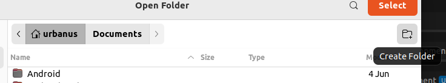

# SE-Assignment-5
Installation and Navigation of Visual Studio Code (VS Code)
 Instructions:
Answer the following questions based on your understanding of the installation and navigation of Visual Studio Code (VS Code). Provide detailed explanations and examples where appropriate.

 Questions:

**1. Installation of VS Code:**

  **-Describe the steps to download and install Visual Studio Code on Windows 11 operating system. Include any prerequisites that might be needed.**

**(i). Download VS Code**

Open a web browser and go to the Visual Studio Code download page(https://code.visualstudio.com/Download)

Click on the "Download for Windows" button to download the installer.

**(ii) Run the Installer:**

   Locate the downloaded file (usually in the Downloads folder) and double-click VSCodeSetup.exe to run the installer.

   **Installer Setup:**

   Click "Next" to start the installation process.

   Accept the license agreement and click "Next".

   Choose the destination folder where you want to install VS Code and click "Next".

   Select additional tasks such as creating a desktop icon and adding VS Code to the PATH (recommended) and click "Next".

   Click "Install" to begin the installation.

   **Launch VS Code:**

   Once the installation is complete, check the "Launch Visual Studio Code" box and click "Finish" to start VS Code.
   

**2. First-time Setup:**

   **- After installing VS Code, what initial configurations and settings should be adjusted for an optimal coding environment? Mention any important settings or extensions.**
   
 **(i)Theme:**

    Go to File > Preferences > Color Theme and select your preferred theme.

    Extensions:

      Install essential extensions like:

     1. ESLint: For JavaScript/TypeScript linting.
     2. Prettier: For code formatting.
     3. Live Server: To run a development server for static and dynamic pages.
     4. Python: If you plan to work with Python.
     5. C/C++ for Visual Studio Code if working with C++ or C 
     6. Flutter : if you plan to use the flutter for creation of mobile and websites
     7. Dart: this will enable us use the  Dart programming language

    
 **Version Control:**

  Set up Git integration by installing the Git extension and configuring your user details (name and email).
  Download Git:

   Go to the Git for Windows website(https://gitforwindows.org/)

   

   Click on the "Download" button to download the latest version of the Git installer.

   Setup Wizard:

   **Select Destination Location:**

      Use the default installation location or choose a different one, then click "Next".

   **Select Components:**

      Choose the components you want to install. The default selection is usually fine. Click "Next".

   **Select Start Menu Folder:**

      Choose the start menu folder or leave it as default. Click "Next".

   **Choosing the Default Editor Used by Git:**

      Select the text editor you want Git to use by default (e.g., Vim, Notepad++, Nano, Visual Studio Code). Click "Next".
      
   **Adjusting Your PATH Environment:**

      Choose "Git from the command line and also from 3rd-party software". This option allows you to use Git from the Windows Command Prompt and PowerShell. Click "Next".

   **Choosing HTTPS Transport Backend:**

      Choose the option "Use the OpenSSL library". Click "Next".

   **Configuring the Line Ending Conversions:**

      Choose "Checkout Windows-style, commit Unix-style line endings". Click "Next".

  **Configuring the Terminal Emulator to Use with Git Bash:**

      Choose "Use MinTTY (the default terminal of MSYS2)". Click "Next".

   **Configuring Extra Options:**

      Leave the default options selected (Enable file system caching, Enable Git Credential Manager). Click "Next".

   **Configuring Experimental Options:**

      You can enable experimental options if you want, but it's generally safe to leave them unchecked. Click "Install".

   **Complete Installation:**

      Wait for the installation to complete.
      Click "Finish" once the installation is done.

   **Configuring Git for Global Use**
      After installing Git, you need to configure it for global use:

      Open Git Bash:

      Search for "Git Bash" in the Windows Start menu and open it.

      Set Your Name: git config --global user.name "Your Name"
     
      Set Your Email  git config --global user.email "your.email@example.com"

      

     
       
**3. User Interface Overview:**
   - Explain the main components of the VS Code user interface. Identify and describe the purpose of the Activity Bar, Side Bar, Editor Group, and Status Bar.

   **Activity Bar:**

      Located on the far left-hand side. Lets you switch between views and gives you additional context-specific indicators, like the number of outgoing changes when Git is enabled. You can change the position of the Activity Bar.

  **Primary Side Bar** - Contains different views like the Explorer to assist you while working on your project.

   **Editor Group:**

   The main area where you open and edit files. You can have multiple editor groups to split the view and work on multiple files simultaneously.

   **Status Bar:**

   Located at the bottom, it shows information about the current project, such as Git branch, errors, and warnings, current line number, and language mode.

   **Panel** - An additional space for views below the editor region. By default, it contains output, debug information, errors and warnings, and an integrated terminal. The Panel can also be moved to the left or right for more vertical space.

   

**4. Command Palette:**
   - What is the Command Palette in VS Code, and how can it be accessed? Provide examples of common tasks that can be performed using the Command Palette.

    The most important key combination to know is Ctrl+Shift+P, which brings up the Command Palette. 

      Ctrl+P enables you to navigate to any file or symbol by typing its name

      Ctrl+Tab cycles you through the last set of files opened

      Ctrl+Shift+P brings you directly to the editor commands

      Ctrl+Shift+O enables you to navigate to a specific symbol in a file
       
      Ctrl+G enables you to navigate to a specific line in a file

    

**5. Extensions in VS Code:**

   - Discuss the role of extensions in VS Code. How can users find, install, and manage extensions? Provide examples of essential extensions for web development.

   You can browse and install extensions from within VS Code. Bring up the Extensions view by clicking on the Extensions icon in the Activity Bar on the side of VS Code or the View: Extensions command (Ctrl+Shift+X).

   

   This will show you a list of the most popular VS Code extensions on the VS Code Marketplace.

   Install an extension
   To install an extension, select the Install button. Once the installation is complete, the Install button will change to the Manage gear button.

      **Essential Extensions for Web Development:**

      HTML/CSS Support

      JavaScript (ES6) code snippets

      Live Server

      Prettier

      ESLint

   

6. **Integrated Terminal:**
   - Describe how to open and use the integrated terminal in VS Code. What are the advantages of using the integrated terminal compared to an external terminal?

      You can open a terminal as follows:

      From the menu, use the Terminal > New Terminal or View > Terminal menu commands.

      From the Command Palette (Ctrl+Shift+P), use the View: Toggle Terminal command.

      In the Explorer, you can use the Open in Integrated Terminal context menu command to open a new terminal from a folder.

      To toggle the terminal panel, use the Ctrl+` keyboard shortcut.

      To create a new terminal, use the Ctrl+Shift+` keyboard shortcut.

      

      **Advantages:**

      Directly run commands within VS Code without switching context.

      Easily execute tasks, scripts, and version control commands in the same environment.

**7. File and Folder Management:**

   - Explain how to create, open, and manage files and folders in VS Code. How can users navigate between different files and directories efficiently?

     Creating:

     1. click on the open folder
     

      click on create a new folder
     

      click on create a new folder
     

      Right-click in the Explorer view and select "New File" or "New Folder".
     

      Click a file in the Explorer view to open it in the Editor Group.
      Managing:   

      Drag and drop files/folders to move them.
      Use the Explorer view to navigate between files and directories.
      Efficient Navigation:

      Use Ctrl+P to quickly open files.
      Use Ctrl+Tab to switch between open files.

**8. Settings and Preferences:**

- Where can users find and customize settings in VS Code? Provide examples of how to change the theme, font size, and keybindings.

   Customizing Settings:

   Accessing Settings:

   Go to File > Preferences > Settings or press Ctrl and ,
   Examples:

   Change Theme:

   File > Preferences > Color Theme.

   Change Font Size:

   Search for "Font Size" in the settings and adjust.

   Change Keybindings:
   
   File > Preferences > Keyboard Shortcuts or press Ctrl+K Ctrl+S.

   

**9. Debugging in VS Code:**
   - Outline the steps to set up and start debugging a simple program in VS Code. What are some key debugging features available in VS Code?
   
    1. Open a Project:

   Open the folder containing your project.

   2. Configure Debugger:

   Go to Run > Add Configuration and select the appropriate configuration for your project.

   3. Start Debugging:

   Set breakpoints by clicking on the gutter next to the line numbers.

   **Press F5 to start debugging.**

   Key Debugging Features:

   Breakpoints

   Watch Variables

   Call Stack

   Step In/Out/Over

10. Using Source Control:
    - How can users integrate Git with VS Code for version control? Describe the process of initializing a repository, making commits, and pushing changes to GitHub.

    **Configure Git**
      Open your terminal or command prompt.
      Configure your Git username and email:

      git config --global user.name "Your Name"
      git config --global user.email "your.email@example.com"

      git init

      git commit -m "first commit"

      git branch -M main

      git remote add origin https://github.com/your-username/your-repository.git

      git push -u origin main

      **REFERENCES**
      https://code.visualstudio.com/docs/getstarted/userinterface
      https://code.visualstudio.com/docs/editor/extension- 
       marketplace#:~:text=You%20can%20browse%20and%20install,Ctrl%2BShift%2BX).
      https://code.visualstudio.com/docs/terminal/basics
      https://github.com/urbanus-dev/commands
